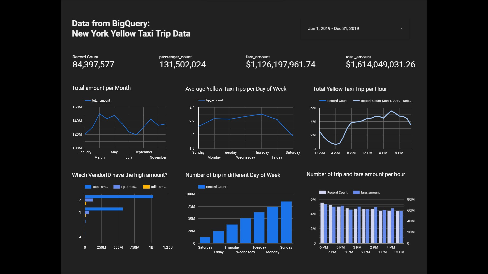

# **Create Dashboard using Google Data Studio**

**Description:**
1. In the scorecard section there is data on the number of records, total passenger count, total fare_amount, and total amount in a year, namely 2019
2. The first chart (time series) is the Total Amount per Month where the highest total amount occurs in March 2019
3. The second chart (time series) is the Average Yellow Taxi Tips per Day of Week, where the highest average occurs on Thursday, which is 2.3
4. The third chart (time series) is the Total Yellow Taxi Trip per Hour where the highest trip occurs at 6 PM
5. The fourth chart (bar chart) is the VendorID who have the high amount (total_amount, tip_amount, tolls_amount), that is VendorID 2
6. The fifth chart (column chart) is Number of trip in different Day of Week where the highest trip occurs in Sunday
7. The sixth chart (column chart) is Number of trip and fare amount per hour where the highest fare amount occurs at 6 PM

### Link to dashboard: [Yellow Trip Data](https://datastudio.google.com/reporting/2c96c05c-c7e0-449d-8a70-f4937e3d7205)
